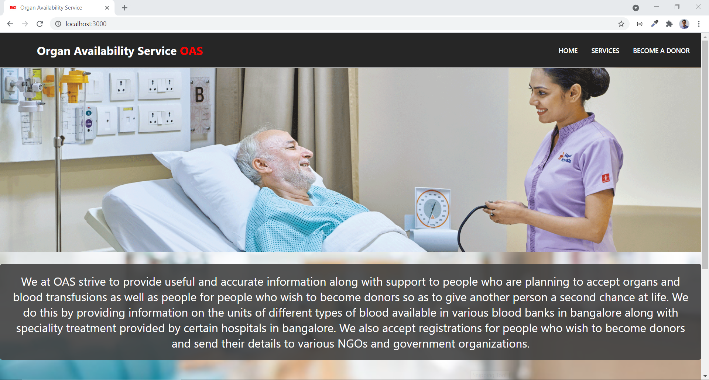
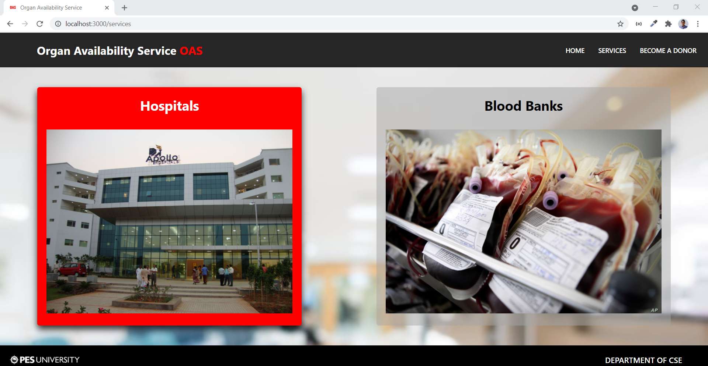
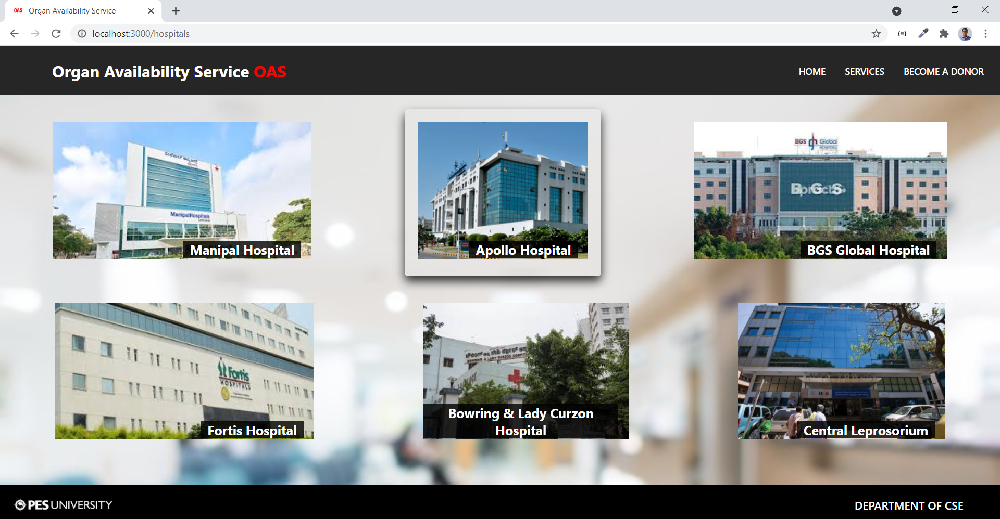
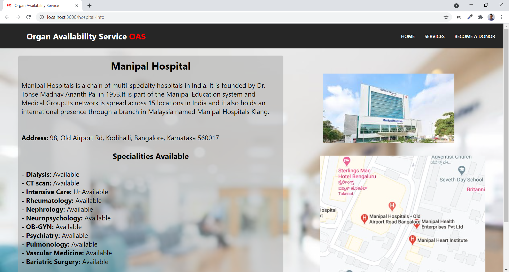
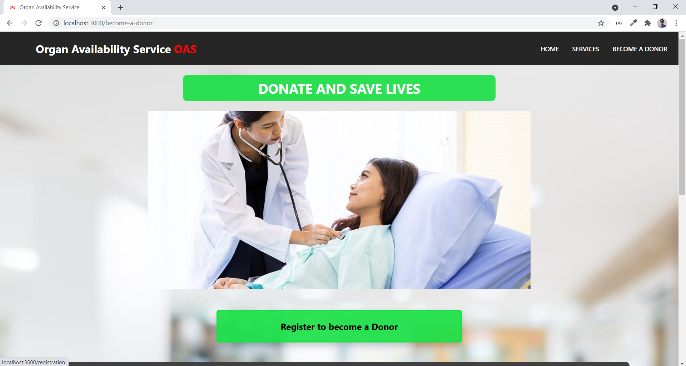
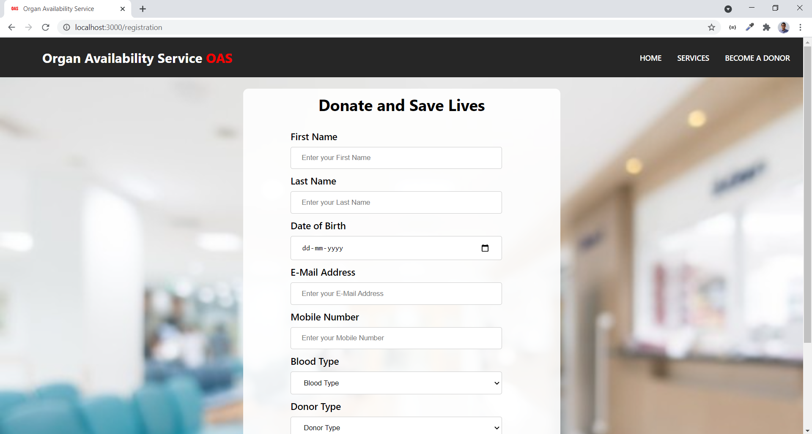

# Organ Availability Service

OAS is a full stack website created using react that aims to increase awareness of organ and blood donations while also helping people who wish to find hospitals with speciality facilities along with information on blood banks in Bangalore.

## Dependencies Installation
1.  Navigate to the oas folder and type the following commands to install the required node modules and to start the react server. 
```
npm install
npm start
```
2.  Navigate to the backend folder and type the following commands to install the required node modules and to run the backend server.
```
npm install
node server.js
```
3. Create a Database called Oas and add the json information into the three collections hospitals, bloodbanks and donors.

## Stack used
* React for frontend.
* Node.js for the javascript server.
* MongoDB for the NoSQL database.
* Express.js for building REST APIs.

## Preview of some Webpages

### The Home Page of the website.

 

<br/>

### Below pages show various hospitals and blood banks along with their additional information when selected. This data is stored on our MongoDB database and is retrieved using our REST APIs through GET requests.





<br/>

### Below is the registration page along with a form that takes in the user's inputs and writes it to the database using a POST request of the REST APIs.



